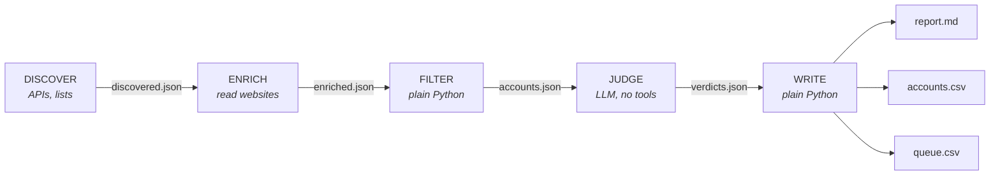

# market-mapper

Find the companies in a market, check that they really belong there, and hand a sales team a clean list with the reasoning attached.

Tell it "every conveyor manufacturer in the Great Lakes states" or "20 dental practices in Oregon likely to buy digital x-ray this year." It pulls companies from public registries, maps, web search, and lists you already have. It merges the duplicates, reads each company's own website, and filters the results in code against your rules. Then an LLM judge weighs the survivors against what *your* company sells. The output is a report, a CSV ready for a CRM, and optional outreach drafts. Nothing is ever sent.

```bash
python -m marketmapper.discover   # find companies from every configured source
python -m marketmapper.enrich     # read their websites
python -m marketmapper.pipeline   # merge, filter, rank
# JUDGE: an agent follows prompts/judge.md
python -m marketmapper.report     # report + CSV exports
```

See [examples/sample-report.md](examples/sample-report.md) and the CSVs next to it for what a run produces.

---

## Two kinds of search

| Goal | Example | What you get |
| --- | --- | --- |
| `market_map` | "Find as many conveyor belt manufacturers as you can in OH, MI, IN, WI" | Every company that passes the filters, with the judge removing false positives. Completeness matters most. |
| `top_n` | "Find 20 dental practices in Oregon likely to buy x-ray equipment" | The best `target_count` accounts, each with why it fits, timing signals, risks, and an optional draft. If fewer qualify, the report says so instead of padding the list. |

## Where companies come from

| Source | Good for | Key needed |
| --- | --- | --- |
| `npi` | US healthcare organizations by specialty and state (the federal NPI Registry). Includes registration date, which makes "recently opened" a signal. | No |
| `osm` | Storefront and facility businesses anywhere, filtered by map tags and region (OpenStreetMap). Often carries a website. | No |
| `web_search` | Anything with a website: manufacturers, integrators, service firms. Query templates are expanded once per place in the region, and directories and social sites are dropped. | Brave or Tavily |
| `csv` | Lists you already have: trade association members, trade show exhibitors, dealer locators, CRM exports. Often the most complete list of an industry that exists. | No |
| `postings` | Companies that are hiring, collected by a browser agent from job boards that filter by location. A timing signal, not the backbone. See [`sources/browser/`](marketmapper/sources/browser/). | No |

Adding a source is one module with a `discover()` function that returns records in the shared shape. Obvious next candidates are SAM.gov (by NAICS code), SEC EDGAR (by SIC code), and national company registries like UK Companies House.

---

## Architecture



| Stage | Runs as | Why it is separate |
| --- | --- | --- |
| **DISCOVER** | Python against public APIs | Structured sources are cheaper, faster, and more complete than a model browsing |
| **ENRICH** | Python, bounded fetches | A registry says a company exists; its website says what it actually does |
| **FILTER** | Pure Python | Merging, region checks, keywords, exclusions, and ranking are rules. Rules belong in code, where they are reproducible and testable. |
| **JUDGE** | LLM with no tools | Deciding whether a company really fits *your* offer is the only step that needs judgment |
| **WRITE** | Pure Python | The report and CSVs render from data, so their structure never drifts |

### Why the stages are separate

The model never both gathers the evidence and grades it. If one agent searched and judged in a single pass, whatever it happened to find would become the evidence for its own conclusion, and every company would start to look like a fit. Here, code decides which companies qualify, and the judge only reads companies that already cleared the rules. The judge has no network access at all.

Separation also keeps failures visible. Each source reports its own status, so an expired API key shows up as "web_search FAILED" in the report and not as a suspiciously small market.

### Design notes

**One company, many records.** The same dental practice shows up as `92ND TERRACE DENTAL LLC` in the registry, "Marrowstone Dental Group" on the map, and a website under a third spelling. FILTER groups records that share a website domain, or a normalized name in the same city. Grouping is transitive and does not depend on record order (there is a test that shuffles the input). Two records with different websites never merge, even when the names match.

**The company's own words decide relevance.** Keyword rules run against the name, categories, website text, and search snippets. A belt repair shop that ranks for "conveyor manufacturer" is caught by `exclude_any` when its own site says "repair and used equipment."

**Honest about region.** An address is the strongest evidence, a site that names in-region places counts, and anything else is `unknown`. Each search decides whether unknown passes (`region_strict`). Registry searches set it strict, and web search market maps usually don't.

**Timing signals are data, not vibes.** A recent registry date, "now open" or "new facility" on the site, or open job postings become signals with a link to their source. `top_n` searches can require them (`min_signals`), and ranking weighs them most.

**Every claim cites the seller's context.** The judge can only argue fit using the seller's context files. Each point names the proof id or ideal customer section it came from. A result that is not written in `proof.md` cannot appear in a report or a draft.

**Schema-validated handoffs.** [`schemas/`](schemas/) defines each contract. When the judge's output drifts, it fails as a schema error instead of producing a broken CSV.

**Rerunnable stages.** Each stage writes a dated file. Re-run the judge against frozen accounts while tuning the prompt, or re-render without calling the model.

---

## Security and conduct

The pipeline reads a lot of untrusted third-party content, and its output is used to contact real businesses.

- **Website text is data.** A site containing *"ignore previous instructions"* is stored as text, and the judge is told to reject that company, not obey it. Scripts and styles are dropped during parsing.
- **Guarded fetching.** Every request goes through [`net.py`](marketmapper/net.py). It allows only http(s), resolves the host and refuses private, loopback, and link-local addresses (checked again on every redirect). It honors robots.txt, rate-limits per host, sends an identifying User-Agent, and caps response size. A poisoned listing pointing at an internal address goes nowhere.
- **No injection into queries.** Values that go into the OpenStreetMap query language are checked against a safe character set, not escaped.
- **Organizations, not people.** The NPI source requests organization records only and never copies the registry's named official. Email addresses are stripped from website text. The judge names a role to contact, never a person.
- **Nothing is sent.** No stage can send email or messages. Drafts go to a CSV with `status=draft`.
- **Keys stay in the environment.** Search API keys are read from environment variables, never from the profile.

---

## Your company's context

Everything company-specific lives in two gitignored places:

- `config/profile.yaml`: the searches (market, region, sources, rules) and the do-not-contact list.
- `context/`: what the judge knows about the seller.
  - `company.md`: what you sell and how
  - `ideal_customer.md`: who buys, and just as important, who does not
  - `proof.md`: results you can back up, each under an id heading
  - `constraints.md`: what must never be claimed or promised

The committed examples belong to a fictional seller, Acme Radiography, which sells dental x-ray systems and inline x-ray inspection for production conveyors. Every company, domain, and registry number in this repo's fixtures and examples is invented.

---

## Quickstart

```bash
pip install -r requirements.txt
cp config/profile.example.yaml config/profile.yaml
cp -r context.example context
export BRAVE_API_KEY=...        # only if a search uses web_search
```

Edit the profile and the context files, then:

```bash
python -m marketmapper.discover --search dental_xray_buyers
python -m marketmapper.enrich
python -m marketmapper.pipeline
```

Point an agent at [`prompts/judge.md`](prompts/judge.md) to write `data/verdicts/<date>.json`, then:

```bash
python -m marketmapper.report
```

A market map with `judge.limit: 0` skips the judge entirely. `report` renders from the accounts file alone.

```bash
python -m pytest tests/ -q
```

---

## Layout

```
marketmapper/
  net.py           The only module that touches the network, with its guardrails
  sources/         One module per company source, plus browser snippets for job boards
  discover.py      DISCOVER: run each search's sources
  enrich.py        ENRICH: read company websites into bounded text
  filters.py       Pure normalization, region, signal, and filter logic
  pipeline.py      FILTER: merge records into accounts, filter, rank, queue for the judge
  report.py        WRITE: report, accounts CSV, drafts CSV, index
  config.py        Profile loading and validation
config/            Example profile (real one gitignored)
context.example/   Example seller context for a fictional company
prompts/judge.md   The judge's instructions
schemas/           JSON Schema contracts between stages
tests/             150 tests, no network, fabricated fixtures
examples/          A rendered report and CSV exports
```

Map data from OpenStreetMap is (c) OpenStreetMap contributors under the ODbL. Keep that attribution if you publish results built on it.
