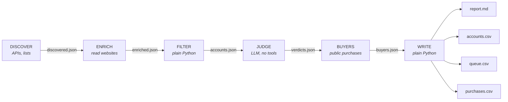

# market-mapper

Finds the companies in a market from public records, reads each company's website, filters them in code, and has Claude judge which ones fit what you sell. The output is a report and a CSV ready for a CRM.

[](https://github.com/BenPortz/market-mapper/actions/workflows/tests.yml)

```bash
market-mapper run --search b2b_software_no_chat
# discover -> enrich -> filter -> judge -> buyers -> report, each stage also runnable on its own
```

## What it does

Companies come from registries, maps, certification listings, OSHA and SEC filings, directories, web search, and CSV lists you already have. Records for the same company merge by website, or by normalized name and city, in any order. Two records with different websites never merge.

The pipeline reads each company's website and records what it says and which chat, scheduler, and tag manager scripts it loads. Region, keyword, exclusion, and ranking rules run in plain Python, so they are reproducible and tested.

Claude judges fit. The judge has no tools and returns structured output. Code checks that every company gets exactly one decision, removes any claim that does not cite the seller's own context files, and raises an error on refusals or truncated output ([judge.py](marketmapper/judge.py)).

Hiring, recent funding, a recent registration, and the tools on a site are stored as signals with a link to their source, and used to rank and filter. Census counts show how complete a list is. A failed source is reported as failed, an unreadable site is "unknown" rather than "no", and a vendor name is matched only when every word of it matches.

Public purchase records show which listed companies sell to government buyers, and which other vendors those buyers pay.

Every fetch blocks private addresses on the request and on each redirect, honors robots.txt, is rate limited per host, and runs no page script. No personal contact data is collected and nothing is ever sent.

## Examples

| Example | Question | Result |
| --- | --- | --- |
| [B2B software with no chat widget](examples/b2b-software-no-chat/) | Which hiring US B2B software companies have no chat or AI assistant on their site? | 126 verified with no widget out of 298. 132 more could not be confirmed either way. |
| [Midwest software, funded or hiring](examples/midwest-software-hiring/) | Which Midwest venture-backed software companies are growing right now? | 18 companies from 38. Six are both recently funded and hiring. |
| [Chicago water valve manufacturers](examples/chicago-water-valves/) | Who makes valves for water in the Chicago metro, and who buys them? | 9 from web search became 14 with certification and OSHA records. Federal buyers purchase through distributors. |

## Two kinds of search

| Goal | Example | What you get |
| --- | --- | --- |
| `market_map` | "Find as many conveyor belt manufacturers as you can in OH, MI, IN, WI" | Every company that passes the filters, minus the ones the judge rejects as not in the market. |
| `top_n` | "Find 20 dental practices in Oregon likely to buy x-ray equipment" | The best `target_count` accounts, each with why it fits, timing signals, risks, and an optional draft. If fewer qualify, the report states the shortfall. |

## Where companies come from

| Source | Good for | Key needed |
| --- | --- | --- |
| `npi` | US healthcare organizations by specialty and state (the federal NPI Registry). Includes registration date, which makes "recently opened" a signal. | No |
| `osm` | Storefront and facility businesses anywhere, filtered by map tags and region (OpenStreetMap). Often carries a website. | No |
| `web_search` | Anything with a website: manufacturers, integrators, service firms. Query templates are expanded once per place in the region, and directories and social sites are dropped. | Brave or Tavily |
| `csv` | Lists you already have: trade association members, trade show exhibitors, dealer locators, CRM exports. Often the most complete list of an industry that exists. | No |
| `nsf` | Manufacturers of products certified for drinking water and plumbing (NSF/ANSI 61 and related listings), filtered by the state of the plant. Certification is required to sell into potable water, so small makers appear whether or not they rank in search. | No |
| `osha_ita` | Plants that file OSHA injury summaries (every manufacturing establishment with 20+ employees), filtered by NAICS code and ZIP. The only source that gives headcount. Reads the public CSV from osha.gov/itadata. | No |
| `yc_directory` | Software companies from the Y Combinator directory (a public JSON mirror): website, locations, industry, tags, team size, batch, and hiring status. A recent batch becomes a "funded" signal; an open hiring flag becomes a "hiring" signal. | No |
| `sec_form_d` | Companies that just raised money, from SEC Form D filings: issuer, address, industry group, and amount sold. Funds and SPVs are dropped; the named people in a filing are never read. Needs a user agent with a contact email, per SEC policy. | No |
| `postings` | Companies that are hiring, collected by a browser agent from job boards that filter by location. Used as a timing signal. See [`sources/browser/`](marketmapper/sources/browser/). | No |

Adding a source is one module with a `discover()` function that returns records in the shared shape. Likely next candidates are SAM.gov (by NAICS code), ASSE and IAPMO product listings, and national company registries like UK Companies House.

## Coverage mode: finding the smaller companies

Search engines rank by traffic, so the same well-known brands fill every results page. A default run finds the leaders in a market and misses small local shops. Coverage mode is a set of search settings that adds the small companies without dropping the leaders.

The `nsf` and `osha_ita` sources list companies because they are certified or because they employ people, so search ranking does not affect them. Each account gets a `size_band`, from OSHA headcount when there is a filing or from a site describing itself as family owned, and the band is exported to the CSV and shown in the report. Setting `prefer: small` lifts known and likely small companies in the ranking so the judge reads them first; large companies still pass the filters and still appear. `market-mapper benchmark` pulls Census County Business Patterns counts for the search's NAICS codes and counties (free key in `CENSUS_API_KEY`), and the report states the gap between the Census count and the list. The Census data names no companies, so it can measure the list but cannot add to it.

On a Chicago water valve search, adding the two coverage sources to the same web search candidates took the list from 9 to 14 manufacturers. The new names included a 180-person flush valve plant and two valve makers with under 40 employees, none of which appeared in any search result. It also confirmed which brand offices have local manufacturing.

## What a company's website runs

When ENRICH reads a company's site it also records which tools the page code loads: chat and AI assistant widgets (Intercom, Drift, Qualified, HubSpot chat, Zendesk, Ada, and about twenty more), meeting schedulers (Chili Piper, Calendly, HubSpot meetings), and tag managers. A search can then require a tool to be absent or present:

```yaml
tech_absent: [chat]          # no chat or assistant widget on the site
tech_present: [scheduler]    # but a demo booking tool
tech_unverified_ok: false    # a tag manager could hide a widget; do not count those as absent
```

Detection reads script tags and embed URLs only, so a blog post that mentions Intercom is not a detection. It also reports what it cannot see. A widget injected through Google Tag Manager never appears in the page HTML, so "no chat, but a tag manager" is its own status (`absent_unverified`), and a site that builds itself in JavaScript or refuses the request is `unknown`. Neither counts as "has no chat". The report states how many companies landed in each status.

## Who buys: public purchase records

A list of companies answers "who could I sell to." A salesperson also wants to know who those companies sell to, and who buys this kind of product at all. Most business-to-business sales leave no public record, but government purchasing does. `market-mapper buyers` reads the finished list and looks up each listed company as a vendor in federal contract awards (USAspending.gov, no key) and in city, county, or state contracts published on any Socrata open data portal. It also looks up the market as a whole: awards for the search's NAICS codes and product keywords, delivered in the search region.

The report gains a "Who buys" section with the listed companies that sell to public buyers, the largest buyers, and the vendors those buyers pay who are not on the list, which are usually the distributors and competitors a salesperson needs to know about. Every purchase is exported to `<search>-purchases.csv` with a link to its source record.

Matching purchase records to companies is strict: a vendor must contain every word of the company's name after legal suffixes, abbreviations ("MFG"), and plurals are normalized. An early version matched on distinctive words only and credited a Chicago valve company with $2.9 billion of awards that belonged to an ad agency and a university. Those names are now regression tests.

## Architecture



| Stage | Runs as | Why it is separate |
| --- | --- | --- |
| DISCOVER | Python against public APIs | Structured sources are cheaper, faster, and more complete than a model browsing |
| ENRICH | Python, bounded fetches | A registry says a company exists; its website says what it does |
| FILTER | Pure Python | Merging, region checks, keywords, exclusions, and ranking are rules, and rules in code are reproducible and testable |
| JUDGE | Claude API, no tools | Deciding whether a company fits the seller's offer is the only step that needs judgment |
| BUYERS | Python against public APIs | Purchase records are looked up after the list is final, and the list is never changed by them |
| WRITE | Pure Python | The report and CSVs render from data, so their structure never drifts |

### Why the stages are separate

The model never both gathers the evidence and grades it. If one agent searched and judged in a single pass, whatever it happened to find would become the evidence for its own conclusion, and every company would start to look like a fit. Here, code decides which companies qualify, and the judge only reads companies that already cleared the rules. The judge has no network access at all.

Separation also keeps failures visible. Each source reports its own status, so an expired API key shows up as "web_search FAILED" in the report rather than as a small market.

### Design notes

The same dental practice shows up as `92ND TERRACE DENTAL LLC` in the registry, "Marrowstone Dental Group" on the map, and a website under a third spelling. FILTER groups records that share a website domain, or a normalized name in the same city. Grouping is transitive and does not depend on record order (there is a test that shuffles the input). Two records with different websites never merge, even when the names match.

Keyword rules run against the name, categories, website text, and search snippets, so a company's own words decide relevance. A belt repair shop that ranks for "conveyor manufacturer" is caught by `exclude_any` when its own site says "repair and used equipment."

For region, an address is the strongest evidence, a site that names in-region places counts, and anything else is `unknown`. Each search decides whether unknown passes (`region_strict`). Registry searches set it strict, and web search market maps usually don't.

A recent registry date, "now open" or "new facility" on the site, or open job postings become timing signals with a link to their source. `top_n` searches can require them (`min_signals`), and ranking weighs them most.

The judge can only argue fit using the seller's context files. Each point names the proof id or ideal customer section it came from. A result that is not written in `proof.md` cannot appear in a report or a draft.

`market-mapper judge` sends Claude the rules ([`judge_rules.md`](marketmapper/prompts/judge_rules.md)), the seller's context, and the company records, with no tools, and constrains the reply to a JSON schema. Code then checks the reply: every queued company gets exactly one decision (a skipped company is recorded as "no decision returned", never dropped), ids the model invents are ignored, any `why_fit` point that does not cite a real heading in the context files is removed, a top-N list is cut to the target with the shortfall stated, and drafts appear only when enabled. The rules and context sit in a cached prefix, so batches after the first mostly pay for the company records. Refusals fall back server-side; truncated or invalid output raises an error instead of writing a partial file.

[`marketmapper/schemas/`](marketmapper/schemas/) defines the contract between stages. When the judge's output drifts, it fails as a schema error instead of producing a broken CSV.

Each stage writes a dated file, so you can re-run the judge against frozen accounts while tuning the prompt, or re-render without calling the model.

## Security and conduct

The pipeline reads a lot of untrusted third-party content, and its output is used to contact real businesses.

- Website text is stored as data. A site containing "ignore previous instructions" is kept as text, and the judge is told to reject that company. Scripts and styles are dropped during parsing.
- Every request goes through [`net.py`](marketmapper/net.py). It allows only http(s), resolves the host and refuses private, loopback, and link-local addresses (checked again on every redirect), honors robots.txt, rate-limits per host, sends an identifying User-Agent, and caps response size.
- Values that go into the OpenStreetMap query language are checked against a safe character set rather than escaped.
- Sources describe organizations, not people. The NPI source requests organization records only and never copies the registry's named official. Email addresses are stripped from website text. The judge names a role to contact, never a person.
- No stage can send email or messages. Drafts go to a CSV with `status=draft`.
- Search API keys are read from environment variables, never from the profile.

## Your company's context

Everything company-specific lives in two gitignored places:

- `config/profile.yaml`: the searches (market, region, sources, rules) and the do-not-contact list.
- `context/`: what the judge knows about the seller.
  - `company.md`: what you sell and how
  - `ideal_customer.md`: who buys, and just as important, who does not
  - `proof.md`: results you can back up, each under an id heading
  - `constraints.md`: what must never be claimed or promised

`config/profile.example.yaml` and `context.example/` belong to a fictional seller, Acme Radiography, and every company in `tests/fixtures/` is invented. The runs in `examples/` use real public records.

## Quickstart

```bash
pip install -e ".[judge]"          # Python 3.10+
cp config/profile.example.yaml config/profile.yaml
cp -r context.example context
export ANTHROPIC_API_KEY=...        # the judge stage (or run `ant auth login`)
export BRAVE_API_KEY=...            # only if a search uses web_search
export CENSUS_API_KEY=...           # only for the coverage check
```

Edit the profile and the context files, then run everything, or one stage at a time:

```bash
market-mapper run --search dental_xray_buyers
market-mapper discover --search dental_xray_buyers
market-mapper enrich
market-mapper filter
market-mapper judge --dry-run       # shows how much would be sent, calls nothing
market-mapper judge
market-mapper buyers                # needs a buyers: section on the search
market-mapper report
```

The judge uses `claude-opus-5` at `high` effort by default; set `judge.model`, `judge.effort`, or `judge.chunk_size` per search. `market-mapper run --no-judge` stops before any model call, and a market map with `judge.limit: 0` renders from the accounts file alone. [`prompts/judge.md`](prompts/judge.md) describes the same stage for an interactive agent instead of the API.

```bash
pip install -e ".[dev]" && pytest -q     # no network, no API keys needed
```

## Layout

```
marketmapper/
  net.py           The only module that touches the network, with its safety checks
  sources/         One module per company source, plus browser snippets for job boards
  discover.py      DISCOVER: run each search's sources
  enrich.py        ENRICH: read company websites into bounded text
  filters.py       Pure normalization, region, signal, and filter logic
  pipeline.py      FILTER: merge records into accounts, filter, rank, queue for the judge
  report.py        WRITE: report, accounts CSV, drafts CSV, index
  judge.py         JUDGE: Claude API call, structured output, and the checks around it
  buyers.py        BUYERS: federal and city purchase records, vendor matching, summaries
  benchmark.py     COVERAGE: Census establishment counts to measure a list against
  config.py        Profile loading and validation
  __main__.py      The market-mapper command
  prompts/         The judge's rules
  schemas/         JSON Schema contracts between stages
config/            Example profile (real one gitignored)
context.example/   Example seller context for a fictional company
prompts/judge.md   The judge stage as instructions for an interactive agent
tests/             273 tests, no network or API keys, invented fixtures
examples/          Three runs on real public records, listed in the table at the top
```

Map data from OpenStreetMap is (c) OpenStreetMap contributors under the ODbL. Keep that attribution if you publish results built on it.

## License

Copyright (c) 2026 Ben Portz. All rights reserved.

This repository is public so the code can be read and evaluated. No license is granted to copy, modify, or distribute it. If you would like to use it, open an issue and ask.
